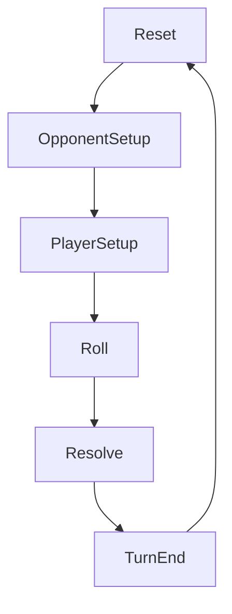

# Game Design (Canonical Rules)

**Role:** The single source of truth for implemented gameplay rules and the intended near-term design.

**Last updated:** 2026-02-25

**Terminology:** See `Docs/Game/Glossary.md`.

## 1) One-line identity

Free or Die is a 1v1 arena duel game where both sides deploy Abilities into **three fixed Combat slots**, roll dice-like values, and exchange damage based on the outcome.

## 2) High-level loop

- Choose an opponent.
- Start a Duel.
- Repeat turns until either side reaches **Health <= 0** or the player **Surrenders**.

## 3) Duel structure

### 3.1 Fixed combat slots

- There are always **3** Combat slots.
- Combat slots are not data-defined entities and have **no IDs**.
- Combat slots are referenced by `combatIndex` in the range **0..2**.

### 3.2 Turn phases

The turn proceeds through phases in this order:

1. Reset
2. OpponentSetup
3. PlayerSetup
4. Roll
5. Resolve
6. TurnEnd (internal processing)

### 3.3 OpponentSetup (enemy deployment)

- The enemy has an `abilityLoadout` (abilityId + count).
- Each opponent ability instance is assigned to a random `combatIndex` in **0..2**.
- The initial placement is uniform random (no “pattern” system).

### 3.4 PlayerSetup (player deployment)

- The player deploys abilities from Loadout into any Combat slot.
- There is currently **no per-slot capacity limit** unless explicitly introduced later.

### 3.5 Roll and resolution

- Only **Attack** type abilities participate in rolling.
- “Power” means the base roll range input for an Attack.
- “Power Result” is the roll output after modifiers.

Rules:

- `PowerResultMin` is **1**.
- There is no explicit upper bound for Power Result (unless introduced later).

### 3.6 Win/Draw/Lose per slot and damage

For each Combat slot:

- Compare **Total Power** for player vs opponent.
- Result is one of:
  - Victory
  - Draw
  - Defeat

Damage:

- If Victory occurs, the winner deals **Damage = 1** to the loser.
- Draw deals **no damage**.
- Effects may override damage rules (e.g., “PreventOutgoingDamageOnWin” sets outgoing damage to 0).

### 3.7 Surrender

Surrender is allowed only if:

- Current phase is **PlayerSetup**
- `Honor > 0`

Effects:

- Duel ends immediately
- **No reward**
- Consume **1 Honor**

## 4) Ability system (current)

- Ability types:
  - **Attack**
  - **Skill** (supported conceptually; detailed triggers may expand)

- Attack:
  - Can be deployed into Combat slots
  - Participates in Roll/Resolve

- Skill:
  - May trigger on specific timings (e.g., Resolve, TurnEnd)
  - Exact behavior is driven by effect definitions

### 4.1 Talent (planned, not implemented)

- Talent is a separate concept intended to replace “Passive Ability”.
- This is not implemented and is not a source of truth yet.

## 5) Key invariants (must remain true unless explicitly changed)

- Combat slots are always exactly 3.
- `combatIndex` is the only way to reference slots.
- Enemy deployment is loadout-based random assignment.
- Invalid data is not silently fixed (validation must be visible).
